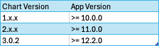

# Valtimo GZAC Helm charts
This repository contains the helm charts for the Valtimo GZAC application.

We maintain three branches, `Release/1.x.x`, `Release/2.x.x` and `main` that are compatible with respectively Valtimo GZAC 10.x, 11.x and 12.x.
Please pick the right chart version to ensure the proper configmap/envvars are setup in your cluster.

Find the helm configuration values here:

* [GZAC Backend](https://github.com/generiekzaakafhandelcomponent/helm-charts/blob/main/charts/gzac-backend/README.md)
* [GZAC Frontend](https://github.com/generiekzaakafhandelcomponent/helm-charts/tree/main/charts/gzac-frontend)

The generated list of published helm releases can be found [here](https://generiekzaakafhandelcomponent.github.io/helm-charts/index.yaml).
